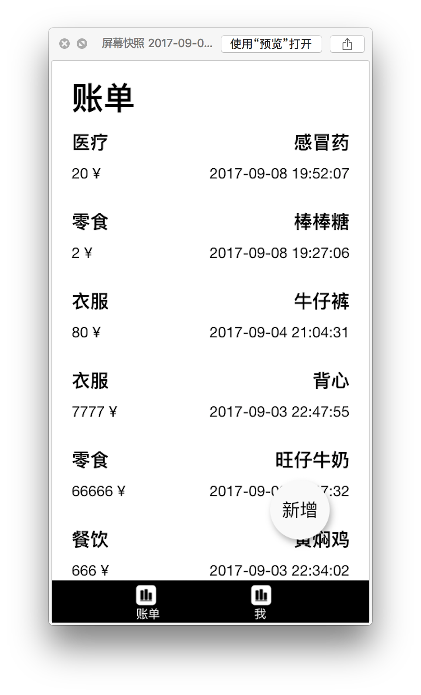

项目使用 Meteor 1.5 ，写的一个记账的小 Demo，目的是为了让新手入门 Meteor 的一个小项目，业务部发展，包含一些基本使用功能。





## 主要内容

- template
 - 生命周期
 - 嵌套
 - 渲染
 - 事件
- 路由
- 账号系统
 - 登陆
 - 登出
 - 注册 
- 数据库增删改查
- 前后端交互
 - API 调用

OSX / LINUX 安装

```
curl https://install.meteor.com/ | sh
```


运行，途中如果你缺少插件，终端会提示语句，按照做就好

```
meteor run 
```

### 文件目录
- .meteor 里面是 Meteor 框架的东西
- client 前端
 - View
     - js
     - CSS
     - HTML 	
- model 模型
- node_modules
- public 放图片
- router 路由
- server 服务器 API


GitHub 地址：https://github.com/liangtongzhuo/tkzd

给点鼓励啦 😊


